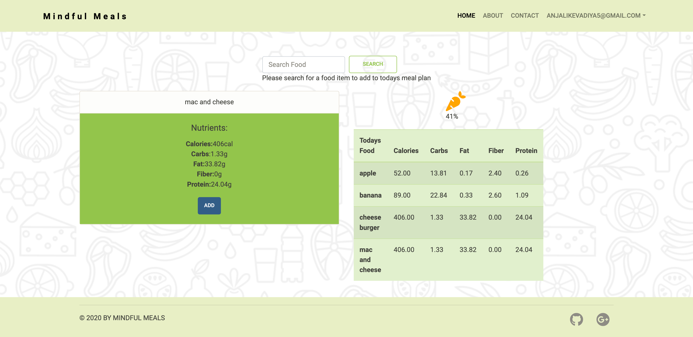

# Mindful Meals

## Table of Contents

- [Description](#description)

- [Technologies Used](#technologies-used)

- [Installation](#installation)

- [Deployed Link](#deployed-link)

- [Preview](#preview)

- [Questions](#questions)

## Description

Sometimes it can be hard to keep track of your daily intake of nutrients. With the help of our app it will become easier to keep track of your daily intake each day. Just eating healthy sometimes isn't enough, you must eat the correct amount of healthy food. Knowing exactly which nutrients you are putting in your body will help to lead a healthier lifestyle.

## Technologies Used

**Language:** Node.js, HTML, CSS

**Dependencies:** Axios, Bcryptjs, Express, Express-session, Js-cookie, Mysql2, Passport, Passport-local, Sequelizer

**Version Control Software:** Git and GitHub

**Cloud Platform:** Heroku

## Installation

To install necessary dependencies, run the following command:

```
npm i
```

OR

```
npm install
```

## [Deployed Link](https://mindful-meals-bc.herokuapp.com/)

## Preview

---

## 

---

## Questions

If you have any questions about the repo, open issue or contact us directly at [mindfulmeals@gmail.com](mindfulmeals@gmail.com).
